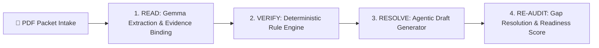

# ClaimReady 🛡️
### Pre-Submission Health Claim Integrity & Agentic Resolution Engine

> **Tagline:** *Find the gap. Fix the packet. Submit with confidence.*  
> **Team:** Team Syntax  
> **Hackathon Track:** Best Use of Gemma AI  

---

## 🌟 Overview

**ClaimReady** is a Gemma-powered, evidence-backed document auditing assistant built for hospital billing and insurance-coordination teams. It audits pre-submission health insurance claim packets (comprising admission records, progress notes, lab/radiology reports, bills, and discharge summaries) to identify missing attachments, chronological discrepancies, and documentation gaps.

Unlike naive AI extractors that guess missing facts or trigger false alarms, ClaimReady adheres to a strict governing philosophy:

> **"AI Understands. Rules Verify. Humans Approve."**

---

## 🚀 The 4-Stage Workflow



1. **READ (Ingestion & Extraction):** PyMuPDF ingests multi-page digital and scanned documents. Gemma extracts structured clinical entities with an **Evidence Contract** (`source_document`, `source_page`, and verbatim `evidence_quote`).
2. **VERIFY (Deterministic Auditing):** Pure Python rule modules evaluate clinical consistency, date chronology, mandatory documents, and investigation statuses.
3. **RESOLVE (Agentic Drafting):** Generates pre-filled, editable **Retrieval Tickets** (for lab/radiology departments) and **Clarification Memos** (for physicians) under complete human supervision.
4. **RE-AUDIT (Differential Verification):** Re-evaluates updated claim packets post-correction, records resolved issues in history, and computes an honest packet readiness status (`INCOMPLETE`, `REVIEW_REQUIRED`, `READY_FOR_HUMAN_REVIEW`).

---

## 🎯 Cardinal Reliability Invariants & Edge Cases

| Edge Case | Naive AI System Failure | ClaimReady Invariant Behavior |
| :--- | :--- | :--- |
| **Advised vs. Performed** | Flags missing report because USG was advised. | Classifies investigation status (`ADVISED`, `PERFORMED`, `CANCELLED`, `UNKNOWN`). Only requires reports for confirmed `PERFORMED` tests. |
| **Clinical Evolution vs. Contradiction** | Flags "suspected appendicitis" vs "acute appendicitis" as a contradiction. | Recognizes diagnostic refinement as normal clinical progression. Escalates true material contradictions (e.g. unexplained Left Knee vs Appendicitis). |
| **Date Ambiguity** | Arbitrarily converts ambiguous format `04/05/26` to a guess. | Preserves raw text string, flags ambiguity for staff verification, and avoids asserting chronology errors on ambiguous dates. |
| **Uncertain Extractions** | Hallucinates or guesses illegible handwriting. | Returns an explicit `UNKNOWN` state, sets `needs_review = True`, and links to the source page for human inspection. |

---

## 📂 Project Structure

```text
ClaimReady/
├── app.py                     # Interactive Streamlit Audit Workspace
├── prd.md                     # Product Requirements Document
├── architecture.md            # Technical & System Architecture Document
├── design.md                  # UI/UX & Interaction Design Specification
├── rules.md                   # Operational Rules & Guidelines
├── memory.md                  # Persistent Context & Continuity Log
├── requirements.txt           # Project Dependencies
├── schemas/                   # Pydantic Schemas & Contracts
│   ├── common.py              # Status & category enums
│   ├── evidence.py            # Evidence Contract model
│   ├── extraction.py          # Extracted clinical facts
│   ├── findings.py            # Audit findings model
│   ├── resolution.py          # Action drafts model
│   └── audit.py               # Audit run & readiness models
├── ingestion/                 # PDF processing & rendering
│   ├── pdf_reader.py          # PyMuPDF text & metadata parser
│   ├── page_renderer.py       # High-res page rasterizer
│   └── ocr.py                 # OCR fallback engine
├── extraction/                # Gemma AI Adapter Layer
│   ├── base.py                # Abstract LLM client protocol
│   ├── prompts.py             # Structured clinical prompts
│   ├── gemma_client.py        # GenAI / Gemma live client
│   ├── mock_client.py         # Deterministic mock client for offline CI
│   └── extractor.py           # Multi-document extraction coordinator
├── verification/              # Deterministic Verification Engine
│   ├── engine.py              # Rule registry & orchestrator
│   ├── required_docs.py       # Mandatory document checks
│   ├── investigation_status.py# Advised vs Performed checks
│   ├── chronology.py          # Temporal ordering & ambiguity checks
│   └── consistency.py         # Diagnostic evolution vs conflict checks
├── resolution/                # Agentic Resolution Engine
│   └── draft_generator.py     # Grounded retrieval tickets & memos
├── audit/                     # Audit & Lifecycle Tracking
│   ├── orchestrator.py        # End-to-end audit runner
│   ├── readiness.py           # Transparent readiness assessment
│   └── re_audit.py            # Differential re-audit engine
├── sample_data/               # Synthetic PDF Test Packets
│   ├── generator.py           # Automated packet builder
│   ├── synthetic_packet_01/   # Advised vs Performed (Missing ECG, Cancelled USG)
│   ├── synthetic_packet_02/   # Chronology & Ambiguous Dates (04/05/26)
│   └── synthetic_packet_03/   # Diagnostic Evolution vs Left Knee Conflict
└── tests/                     # Automated Pytest Suite (13 passing tests)
    ├── test_schemas.py
    ├── test_ingestion.py
    ├── test_rules.py
    └── test_reaudit.py
```

---

## ⚡ Quickstart

### 1. Install Dependencies
```bash
pip install -r requirements.txt
```

### 2. Run Automated Test Suite
```bash
pytest -v tests/
```
*(All 13 tests verify schema contracts, PyMuPDF ingestion, deterministic rules, Advised vs. Performed logic, and re-audit resolution)*.

### 3. Launch Streamlit UI
```bash
streamlit run app.py
```

---

## 🧪 Demonstration Flow

1. **Launch `streamlit run app.py`**.
2. Select **Scenario 1: Advised vs Performed**.
3. Observe that:
   - **USG Abdomen** was advised and cancelled $\rightarrow$ **Correctly NOT flagged as missing!**
   - **12-lead ECG** was performed without an attached trace $\rightarrow$ **Flagged as HIGH severity gap!**
   - Jump straight to cited evidence on Page 2 using the **"View on Page"** button.
4. Review the auto-generated **Retrieval Ticket Draft** for the Cardiology Department.
5. Click **"➕ Add Missing ECG Report & Re-Audit"** in the sidebar.
6. The Re-Audit Engine verifies the uploaded report, marks the ECG finding as **RESOLVED**, and transitions the packet to **🟢 READY FOR HUMAN REVIEW**!
