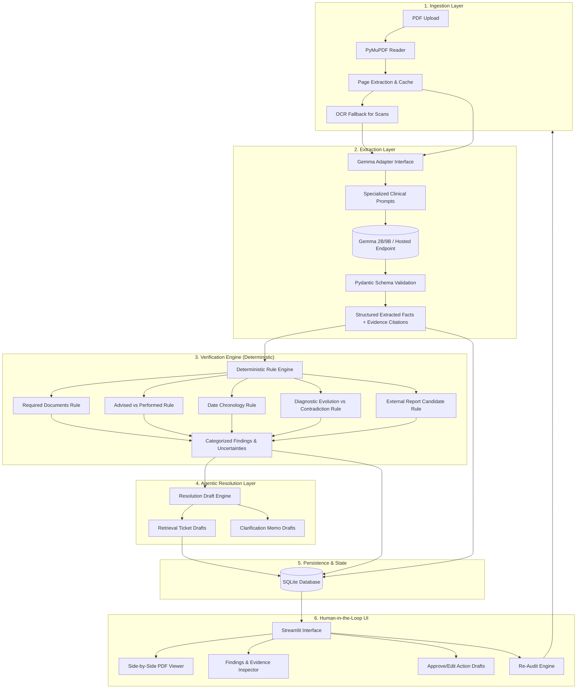

# ClaimReady — Technical Architecture & System Design Document

**Product:** ClaimReady  
**Language:** Python 3.12+ (verified on Python 3.14)  
**Architecture Pattern:** Modular Monolith with Adapter Pattern & Deterministic Rule Pipeline  

---

## 1. High-Level System Architecture

ClaimReady is structured around a strict separation between **stochastic AI interpretation** (Gemma), **deterministic verification rules** (pure Python), and **human governance**.



---

## 2. Directory Structure & Module Breakdown

```text
claimready/
├── app.py                     # Streamlit main entry point
├── config.py                  # Environment config, model endpoints, thresholds
├── schemas/                   # Pydantic data models & contracts
│   ├── common.py              # Enums (Status, Severity, DocType, InvestigationStatus)
│   ├── evidence.py            # Evidence quote & page citation models
│   ├── extraction.py          # ExtractedFact, ClinicalRecord, InvestigationItem
│   ├── findings.py            # Finding, FindingCategory, FindingStatus
│   ├── resolution.py          # RetrievalTicket, ClarificationMemo, ActionType
│   └── audit.py               # AuditRun, PacketReadiness, ReadinessStatus
├── ingestion/                 # PDF processing & OCR
│   ├── pdf_reader.py          # PyMuPDF text & metadata extraction
│   ├── page_renderer.py       # High-fidelity page image rendering for UI
│   └── ocr.py                 # OCR engine fallback for scanned documents
├── extraction/                # Gemma LLM integration
│   ├── base.py                # Abstract LLM client interface
│   ├── gemma_client.py        # Gemma implementation (Local / HuggingFace / Endpoint)
│   ├── mock_client.py         # Deterministic mock client for rapid CI & testing
│   ├── prompts.py             # Structured clinical extraction prompts
│   └── extractor.py           # Orchestrates page parsing, schema validation & retry
├── verification/              # Pure deterministic verification rules
│   ├── engine.py              # Rule orchestrator & registry
│   ├── required_docs.py       # Validates presence of mandatory & cited files
│   ├── investigation_status.py# Advised vs Performed verification
│   ├── chronology.py          # Date ordering & format ambiguity validation
│   ├── consistency.py         # Diagnostic evolution vs contradiction checks
│   └── external_matching.py   # Multi-identifier matching for external candidates
├── resolution/                # Agentic drafting module
│   ├── draft_generator.py     # Uses Gemma to draft grounded tickets & memos
│   └── templates.py           # Fallback structured draft templates
├── audit/                     # Audit lifecycle & differential tracking
│   ├── orchestrator.py        # End-to-end audit runner
│   ├── readiness.py           # Readiness score & status determination
│   └── re_audit.py            # Differential re-audit logic (open vs resolved)
├── persistence/               # Database and repository pattern
│   ├── database.py            # SQLite connection & schema initialization
│   └── repository.py          # CRUD operations for packets, findings, drafts
├── ui/                        # Modular Streamlit components
│   ├── components.py          # Custom CSS, badges, cards
│   ├── viewer.py              # Interactive PDF preview with page jumper
│   ├── findings_view.py       # Findings list & evidence inspector
│   └── actions_view.py        # Action draft editing & approval workspace
├── sample_data/               # Synthetic test packets (PDFs & JSON fixtures)
│   ├── synthetic_packet_01/   # Missing USG report (Advised vs Performed)
│   ├── synthetic_packet_02/   # Date chronology mismatch & ambiguous format
│   └── synthetic_packet_03/   # Diagnostic evolution vs conflict
└── tests/                     # Automated pytest suite
    ├── test_ingestion.py
    ├── test_extraction.py
    ├── test_rules.py
    ├── test_resolution.py
    └── test_reaudit.py
```

---

## 3. Core Data Contracts (Pydantic Schemas)

### 3.1 Evidence Contract
```python
class SourceEvidence(BaseModel):
    source_document: str
    source_page: int
    evidence_quote: str
    confidence: float = Field(default=1.0, ge=0.0, le=1.0)
    is_uncertain: bool = False
```

### 3.2 Investigation Record
```python
class InvestigationStatus(str, Enum):
    ADVISED = "ADVISED"
    PERFORMED = "PERFORMED"
    CANCELLED = "CANCELLED"
    UNKNOWN = "UNKNOWN"

class InvestigationRecord(BaseModel):
    investigation_id: str
    name: str
    status: InvestigationStatus
    date_raw: str | None = None
    date_normalized: str | None = None
    ordering_physician: str | None = None
    evidence: SourceEvidence
```

### 3.3 Audit Finding
```python
class FindingCategory(str, Enum):
    MISSING_DOCUMENT = "MISSING_DOCUMENT"
    INVESTIGATION_GAP = "INVESTIGATION_GAP"
    CHRONOLOGY_MISMATCH = "CHRONOLOGY_MISMATCH"
    DATE_AMBIGUITY = "DATE_AMBIGUITY"
    DIAGNOSTIC_CONTRADICTION = "DIAGNOSTIC_CONTRADICTION"
    UNCERTAIN_EXTRACTION = "UNCERTAIN_EXTRACTION"

class FindingStatus(str, Enum):
    OPEN = "OPEN"
    RESOLVED = "RESOLVED"
    OVERRIDDEN = "OVERRIDDEN"
    ESCALATED = "ESCALATED"

class Finding(BaseModel):
    finding_id: str
    category: FindingCategory
    rule_id: str
    title: str
    description: str
    severity: Literal["HIGH", "MEDIUM", "LOW"]
    evidence: list[SourceEvidence]
    suggested_action: str
    status: FindingStatus = FindingStatus.OPEN
    override_reason: str | None = None
```

### 3.4 Action Drafts
```python
class ActionType(str, Enum):
    RETRIEVAL_TICKET = "RETRIEVAL_TICKET"
    CLARIFICATION_MEMO = "CLARIFICATION_MEMO"

class ResolutionDraft(BaseModel):
    draft_id: str
    finding_id: str
    action_type: ActionType
    target_department: str
    subject: str
    body: str
    is_approved: bool = False
    approved_by: str | None = None
```

---

## 4. Gemma Adapter Pattern

To isolate LLM dependencies, model invocation is abstracted behind a clean protocol:

```python
class BaseGemmaClient(ABC):
    @abstractmethod
    def extract_entities(self, text: str, page_number: int, doc_name: str) -> ExtractedFacts:
        """Extract structured medical entities with page-grounded evidence."""
        pass

    @abstractmethod
    def generate_draft(self, finding: Finding, context: dict) -> ResolutionDraft:
        """Generate a grounded clarification memo or retrieval ticket."""
        pass
```

Implementations:
1. `GemmaInferenceClient`: Calls Hugging Face Transformers local pipeline or Gemma endpoint.
2. `GeminiGemmaClient`: Calls Google GenAI API endpoint if configured.
3. `MockGemmaClient`: Deterministic mock returning grounded synthetic test data for offline CI/CD and rapid demo resilience.

---

## 5. Verification Rules Engine Design

Each rule is a pure function taking `ExtractedFacts` and returning `list[Finding]`.

* **Rule REQ-01 (`required_docs.py`):** Checks that required documents (Discharge Summary, Final Bill) exist.
* **Rule INV-01 (`investigation_status.py`):** Inspects all `InvestigationRecord` items. If `status == PERFORMED`, checks whether corresponding report is attached. If `status == ADVISED` or `CANCELLED`, does **not** flag as missing report. If `status == UNKNOWN`, generates an `UNCERTAIN_EXTRACTION` finding.
* **Rule CHRON-01 (`chronology.py`):** Checks chronological order. Detects format ambiguity (e.g. `04/05/2026`) and flags `DATE_AMBIGUITY` without assuming day/month ordering.
* **Rule CON-01 (`consistency.py`):** Analyzes admission vs discharge diagnoses. Refinements are approved; side mismatches (e.g., Left vs Right) generate `DIAGNOSTIC_CONTRADICTION`.

---

## 6. Persistence & Storage Model

SQLite schema with WAL mode enabled:
* `packets`: Stores packet ID, patient MRN, created timestamp, status.
* `documents`: Stores document ID, file path, doc type, page count.
* `extracted_facts`: Stores JSON payload of extracted fields with evidence.
* `audit_runs`: Stores audit run ID, packet ID, timestamp, readiness status.
* `findings`: Stores individual findings, rule IDs, status, override reasons.
* `action_drafts`: Stores drafts, approvals, and dispatch logs.

---

## 7. Security & Prompt Injection Defenses

* **Data Isolation:** All input documents are processed strictly as passive strings wrapped in explicit delimiter tags (`<document_content>...</document_content>`).
* **Zero System Access:** System prompts explicitly forbid following commands inside document texts.
* **Synthetic Data Only:** Default data directories contain strictly synthetic patient names and records.
