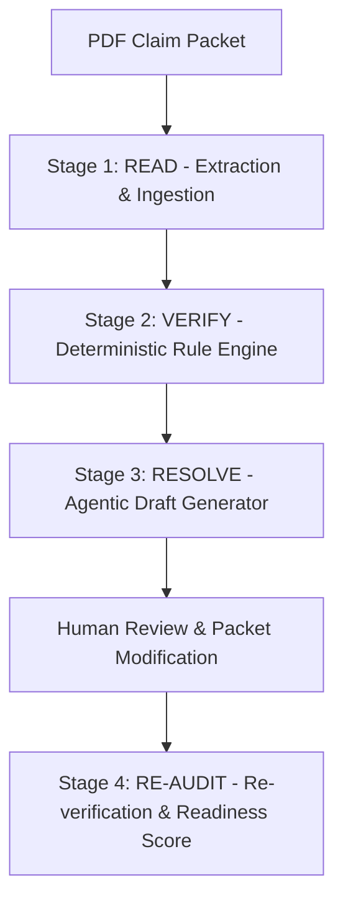

# ClaimReady — Product Requirements Document (PRD)

**Project Name:** ClaimReady  
**Full Name:** Pre-Submission Health Claim Integrity & Agentic Resolution Engine  
**Tagline:** Find the gap. Fix the packet. Submit with confidence.  
**Team:** Team Syntax  
**Hackathon Track:** Best Use of Gemma AI  

---

## 1. Executive Summary

ClaimReady is a Gemma-powered, evidence-backed document auditing assistant designed for hospital billing and insurance-coordination teams. It analyzes multi-document health claim packets prior to insurer submission to identify missing attachments, chronological inconsistencies, ambiguous dates, and documentation gaps, while generating grounded resolution drafts (retrieval tickets and clarification memos) under complete human supervision.

### Core Philosophy
> **"AI Understands. Rules Verify. Humans Approve."**

---

## 2. Problem Statement & User Personas

### 2.1 The Problem
When a patient is discharged, hospital billing staff must assemble claim packets comprising admission notes, doctor orders, diagnostic reports, discharge summaries, and itemized bills. Missing records or minor discrepancies (e.g. mismatched dates, an advised investigation with no accompanying report or cancellation note) lead to claim rejections, delays in cashless settlement, and endless manual coordination cycles between billing, wards, labs, and third-party administrators (TPAs).

Existing tools fail because:
* **Generic AI extractors** hallucinate, assume advised tests were performed, misread ambiguous dates, or falsely flag clinical evolutions as contradictions.
* **Static checklists** cannot verify nuanced cross-document consistency or explain *why* something is missing.
* **Manual workflows** are slow, reactive, and prone to human error under high hospital discharge volumes.

### 2.2 Target Personas
1. **Hospital Billing Executive:** Prepares pre-submission cashless claim files; needs rapid detection of missing mandatory documents and instant retrieval drafts.
2. **Insurance Coordinator / TPA Desk Officer:** Verifies clinical and chronological consistency across reports before sending to the insurer; needs traceable evidence quotes for each flagged finding.
3. **Medical Records Officer (MRO):** Receives structured retrieval requests to supply archived lab/radiology reports.

---

## 3. Product Goals & Scope

### 3.1 Primary Goals
1. **Multi-Document PDF Intake:** Ingest digital and scanned PDF claim packets.
2. **Traceable Extraction (Evidence Contract):** Extract key clinical and administrative entities with exact page and quote citations.
3. **Deterministic Verification:** Execute strict, explainable rule checks against extracted facts.
4. **Actionable Resolution Engine:** Generate editable draft retrieval tickets and clarification memos.
5. **Human-in-the-Loop Workflow:** Enable staff to review evidence, modify drafts, override findings, and update packets.
6. **Dynamic Re-Audit & Readiness Scoring:** Re-evaluate packet readiness post-correction while preserving historical audit trails.
7. **Measurable Gemma Value:** Benchmark Gemma's extraction and reasoning fidelity against representative edge cases.

### 3.2 Non-Goals & Boundaries
* **Not an Adjudicator:** Does not determine clinical necessity or predict insurer payment.
* **No Autonomous Actions:** Does not automatically dispatch emails or alter external hospital systems without human approval.
* **No Hallucinated Facts:** Does not infer unstated dates, diagnoses, or tests.
* **Untrusted Data Boundary:** PDFs are treated purely as passive data, never executable instructions.

---

## 4. The 4-Stage Operational Workflow

### Stage 1: READ (Ingestion & Extraction)
* Extract embedded digital text via PyMuPDF; route scanned pages through OCR fallback.
* Classify document types (`admission_note`, `discharge_summary`, `lab_report`, `radiology_report`, `bill`, `unknown`).
* Use Gemma to parse structured entities: patient identifiers, admission/discharge dates, diagnoses, investigation orders and statuses, procedure details, and referenced attachments.
* **Mandatory Evidence Binding:** Every fact must carry `source_document`, `source_page`, and verbatim `evidence_quote`. Flag illegible or low-confidence data as `needs_review = True`.

### Stage 2: VERIFY (Deterministic Auditing)
Evaluate extracted facts against explicit Python rule modules:
1. **Required Documents Check:** Ensure required files (e.g. Discharge Summary, Final Bill) and all referenced investigation reports are present.
2. **Investigation Status Check:** Ensure reports are only demanded for tests confirmed as `PERFORMED`.
3. **Chronology & Date Check:** Check that admission date $\le$ procedure date $\le$ discharge date $\le$ billing date. Flag unresolvable date conventions.
4. **Cross-Document Consistency:** Verify matching patient identifiers, demographics, and primary diagnoses across documents.
5. **Output Categorization:** Classify findings into `Confirmed Finding`, `Potential Gap`, `Uncertain Extraction`, or `Incomplete Check`.

### Stage 3: RESOLVE (Action Generation)
For each open finding, generate an evidence-grounded action draft:
* **Retrieval Ticket:** Draft for records/lab department requesting missing reports with exact patient details, investigation name, and ordering date.
* **Clarification Memo:** Draft for treating physician asking to clarify ambiguous dates, diagnostic discrepancies, or cancellation confirmation.
* Provide an interactive UI workspace allowing staff to edit, approve, or reject drafts.

### Stage 4: RE-AUDIT (Feedback Loop)
* Allow uploading missing/updated PDFs or recording human-verified overrides.
* Re-run verification rules.
* Present a comparative diff:
  * Resolved findings
  * Persistent open findings
  * Newly introduced findings
* Compute the honest readiness summary:
  * `INCOMPLETE` (processing errors or missing core pages)
  * `REVIEW_REQUIRED` (open gaps or unverified findings remain)
  * `READY_FOR_HUMAN_REVIEW` (all automated checks passed or verified)

---

## 5. Critical Reliability Invariants & Edge Cases

| Edge Case | Failure Mode in Naive Systems | ClaimReady Required Behavior |
| :--- | :--- | :--- |
| **Case A: Advised vs. Performed** | Flags missing report because USG was advised. | Classify status (`ADVISED`, `PERFORMED`, `CANCELLED`, `UNKNOWN`). Only require report if status is `PERFORMED`. |
| **Case B: Clinical Evolution vs. Conflict** | Flags "suspected appendicitis" vs "acute appendicitis" as a contradiction. | Treat diagnostic refinement as normal clinical progression. Only flag true material contradictions (e.g. Left vs. Right knee). |
| **Case C: Uncertain Handwriting** | Guesses dates or figures from blurry handwriting. | Preserve raw text, set `needs_review = True`, escalate to user without feeding guessed value into downstream rules. |
| **Case D: Ambiguous Dates** | Arbitrarily converts `04/05/26` to April 5 or May 4. | Preserve raw string, flag ambiguity, and avoid asserting chronological errors based on ambiguous dates. |
| **Case E: External Reports** | Assumes external EHR records or misses matches. | Perform multi-identifier matching (Name + MRN + Date window); suggest retrieval ticket rather than faking access. |

---

## 6. User Interface Requirements

1. **Intake View:** Drag-and-drop PDF packet uploader with instant file validation and page counter.
2. **Interactive Document Viewer:** Side-by-side PDF preview with page navigation jumping straight to cited evidence pages.
3. **Evidence-Linked Findings Panel:** Structured cards displaying Category, Severity, Evidence Quote, Page Reference, and Rule ID.
4. **Action & Draft Workspace:** Pre-filled, editable textareas for retrieval tickets and clarification memos with single-click approval.
5. **Re-Audit & Readiness Dashboard:** High-contrast readiness badges (`INCOMPLETE`, `REVIEW_REQUIRED`, `READY_FOR_HUMAN_REVIEW`), status breakdown metrics, and one-click re-audit trigger.

---

## 7. Success & Evaluation Metrics

* **Field Extraction Accuracy:** $> 95\%$ on synthetic evaluation packets.
* **False Positive Finding Rate:** $< 5\%$ on intentional edge cases (especially advised-only investigations).
* **Audit Latency:** $< 30$ seconds for typical multi-page packet on standard compute.
* **Audit Traceability:** $100\%$ of findings bound to verifiable source page and evidence snippet.

---

## 8. Definition of Done (MVP)

- [ ] Complete pipeline: PDF intake $\rightarrow$ extraction $\rightarrow$ verification $\rightarrow$ resolution $\rightarrow$ re-audit.
- [ ] Working Gemma adapter with structured Pydantic schema validation and fallback handling.
- [ ] Deterministic rule modules passing all 5 edge case test suites.
- [ ] Clean Streamlit UI with PDF viewer, finding cards, and editable action drafts.
- [ ] Re-audit flow demonstrating gap resolution when a missing report is supplied.
- [ ] Complete synthetic data suite with no real patient data.
- [ ] Automated pytest suite covering unit and integration scenarios.
